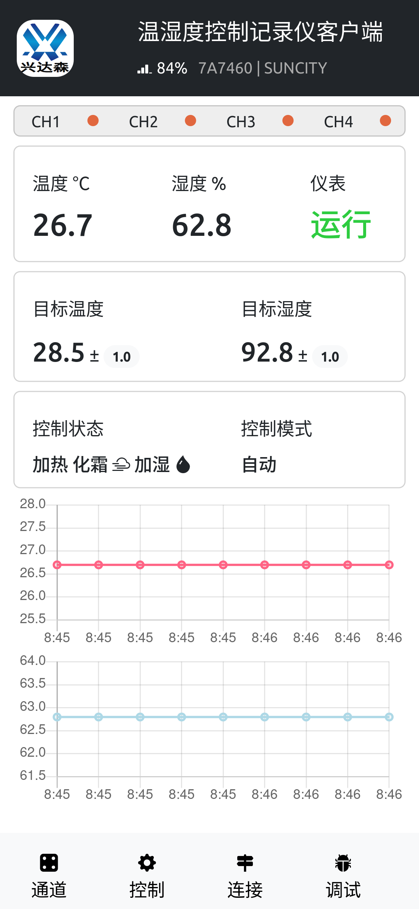

MQTT-DASH
=========



## 项目简介

基于 HTML5+JS 的 MQTT 温湿度仪表盘页面，通过 Android WebView 打包为原生 Debug APK。

## 开发与构建环境

| 项目 | 版本/路径 |
|------|-----------|
| 操作系统 | Windows 11 |
| Java | JDK 17 |
| Android SDK | `C:\Work\Apps\android-sdk` |
| Gradle | 8.8 |
| Android Gradle Plugin (AGP) | 8.3.0 |
| 目标 Android 版本 | 13 (API 34) |
| 最低 SDK | 21 (Android 5.0) |
| 构建工具 | Gradle (./gradlew assembleDebug) |

## 项目结构

```
mqtt-dash/
├── index.html           # 主页面
├── barcode_scan.html    # 二维码扫描页面
├── css/                 # 样式文件
├── js/                  # JavaScript 脚本
│   ├── index.js         # 主逻辑（MQTT连接、数据解析、UI更新）
│   ├── mqttws31.js      # Paho MQTT WebSocket 客户端
│   ├── common.js        # 公共函数
│   ├── Chart.min.js     # 图表库
│   ├── bootstrap.min.js # Bootstrap 库
│   └── jquery.min.js    # jQuery 库
├── img/                 # 图片资源
└── android-app/         # Android 项目
    └── app/
        └── src/main/
            ├── assets/     # 前端资源（HTML/CSS/JS/图片）
            ├── java/       # Java 源码 (MainActivity)
            └── res/        # Android 资源
```

## 构建命令

```bash
cd android-app
./gradlew assembleDebug   # 生成 Debug APK
./gradlew clean           # 清理构建
```

## APK 输出

Debug APK 位于：
```
android-app/app/build/outputs/apk/debug/app-debug.apk
```

当前已验证 `clean assembleDebug` 会将 APK 稳定输出到以上目录。

## 主要功能

- MQTT WebSocket 连接（ws://118.31.36.131:9001）
- 实时温度/湿度数据显示
- 图表展示历史数据
- 控制/调试窗口（设置参数、重启设备等）
- 二维码扫描设备 ID
- 空调状态显示
- WiFi 信号强度指示

## 注意事项

- 使用 `network_security_config.xml` 允许明文 `ws://` 连接
- UI 更新频率已优化为每秒一次，减少主线程占用
- WebView 已禁用 alert 弹窗 URL 前缀显示
- 不要将完整的 `android-app/` 工程目录或任意 `build/` 产物复制到 `android-app/app/src/main/assets/` 下，否则 Gradle 会把这些内容一并当作资源打包，可能导致资源目录递归膨胀，并让 APK 输出定位异常
- 如果再次发现 APK 没有出现在 `android-app/app/build/outputs/apk/debug/app-debug.apk`，优先检查 `android-app/app/src/main/assets/` 下是否误混入了工程副本或构建产物